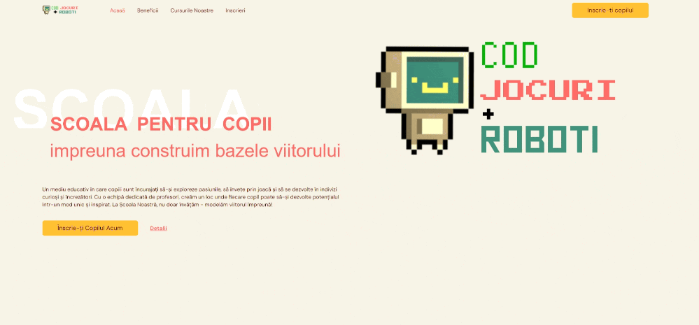
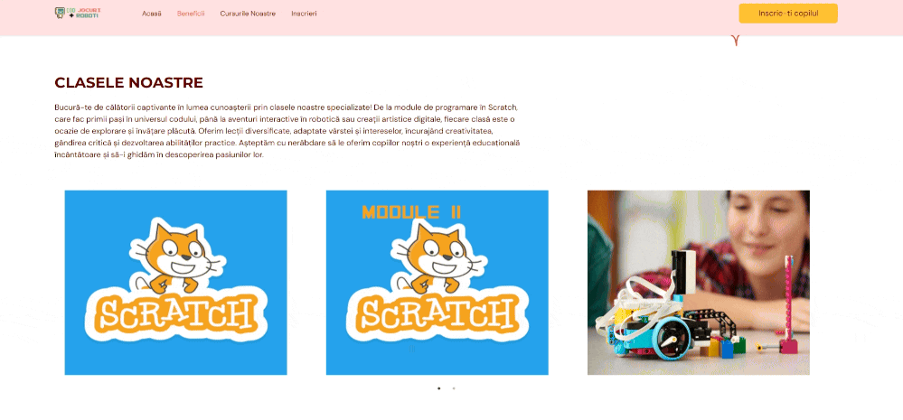
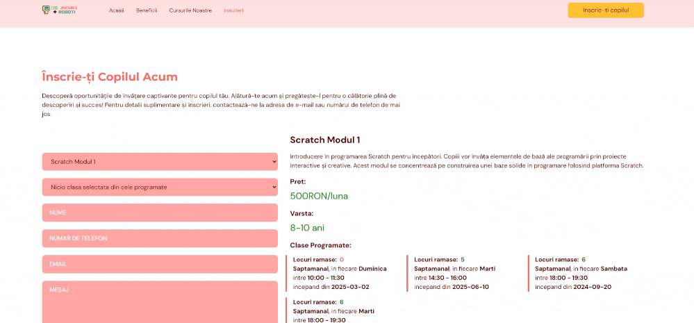

# CODE, GAMES & ROBOTS (COD, JOCURI & ROBOTi)


<div style="text-align: center;">
  
</div>

Website page for an after-school program with a focus on programming languages, software, and hardware, specifically created to facilitate an easier learning process for kids. The website features internationalization for Romanian and English.

The website is divided into four sections:
- Homepage
- Benefits
- Our Classes
- Enrollment

The website is built using React with TypeScript and utilizes Vite for faster development. It incorporates Tailwind, Google Fonts, Hero Icons, and other tools. All graphics and images were modified or converted using GIMP.

Furthermore, the website is responsive and designed to be mobile-friendly as well.

## Main functionalities
- <strong>Navbar:</strong> Provides menu selection options. When scrolling down, the name of the section being scrolled to is highlighted in the navbar. The navbar menu is responsive and resizes by moving all links to the sections into a separate menu under a "≡" button.
- <strong><motion.div> elements:</strong> Can be found in all sections to make the text and graphics slide into the current screen.
- <strong>Our Classes:</strong> Provides a slider of all courses that displays the course description on hover. When resized, the slider transitions from displaying 3 class images per slide to 1 per slide, using different sizes for both the images and the hover box containing the text.
- <strong>Enroll Section:</strong> A form that allows users to see more details about each class. On the left side, the user can select the course of interest, and details of the selection are displayed on the right side: title, description, price, age interval for kids, and scheduled classes.
- <strong>Scheduled Classes:</strong> Selection can also be done under the "Enroll" section. Users can inquire about an entire class or a specific scheduled class for each class. The scheduled class includes a start date, hour interval, frequency (e.g., each Monday), and the number of remaining places. Once a scheduled class is selected, it is highlighted in green on the right side. The selection of the scheduled class can also be made on the right side.
- <strong>Form Validation:</strong> Implemented for the form inputs, ensuring that required details are provided. It also validates that the selected scheduled class has at least one remaining place.
- <strong>formsubmit.co:</strong> Utilized to send the form submission to the appropriate email address.

## Classes configuration

The configuration file for the classes can be found dnder "shared/classData.json":

```json
{
  [
    {
       "name":"one",
       "image":"image1",
       "scheduledClasses":[
          {
             "id":1,
             "startDate":"2025-03-02",
             "startTime":"10:00",
             "endTime":"11:30",
             "frequency":"weekly",
             "dayOfWeek":"sunday",
             "remainingSeats":0
          },
          {
             "id":2,
             "startDate":"2025-06-10",
             "startTime":"14:30",
             "endTime":"16:00",
             "frequency":"weekly",
             "dayOfWeek":"tuesday",
             "remainingSeats":5
          },
          {
             "id":3,
             "startDate":"2024-09-20",
             "startTime":"18:00",
             "endTime":"19:30",
             "frequency":"weekly",
             "dayOfWeek":"saturday",
             "remainingSeats":6
          }
       ]
    },
    {
       "name":"two",
       "image":"image2",
       "scheduledClasses":[
          {
             "id":4,
             "startDate":"2024-03-15",
             "startTime":"09:00",
             "endTime":"10:30",
             "frequency":"weekly",
             "dayOfWeek":"wednesday",
             "remainingSeats":1
          },
          {
             "id":5,
             "startDate":"2024-03-20",
             "startTime":"13:00",
             "endTime":"14:30",
             "frequency":"weekly",
             "dayOfWeek":"thursday",
             "remainingSeats":0
          }
       ]
    }
  ]
}
```

The 'name' attribute is used to retrieve the values for the course from "ro" and "en" json files. For example in the ro.json file, using the 'one' name, the following data will be retrieved :

```json
{
   ...
   "ourclasses.class.one.name": "Scratch Modul 1",
   "ourclasses.class.one.description": "Introducere în programarea Scratch pentru începători. Copiii vor învăța elementele de bază ale programării prin proiecte interactive și creative. Acest modul se concentrează pe construirea unei baze solide în programare folosind platforma Scratch.",
   "ourclasses.class.one.price": "500RON/luna",
   "ourclasses.class.one.ageInterval": "8-10 ani",
   ...
}
```


## Installation

```bash
npm clean install
```

For development purposes, you can run:

```bash
npm run dev
```

For production:

```bash
npm start
```


## Website look&fill

### Desktop view



### Mobile view


### Our classes scroll



### Enroll form


